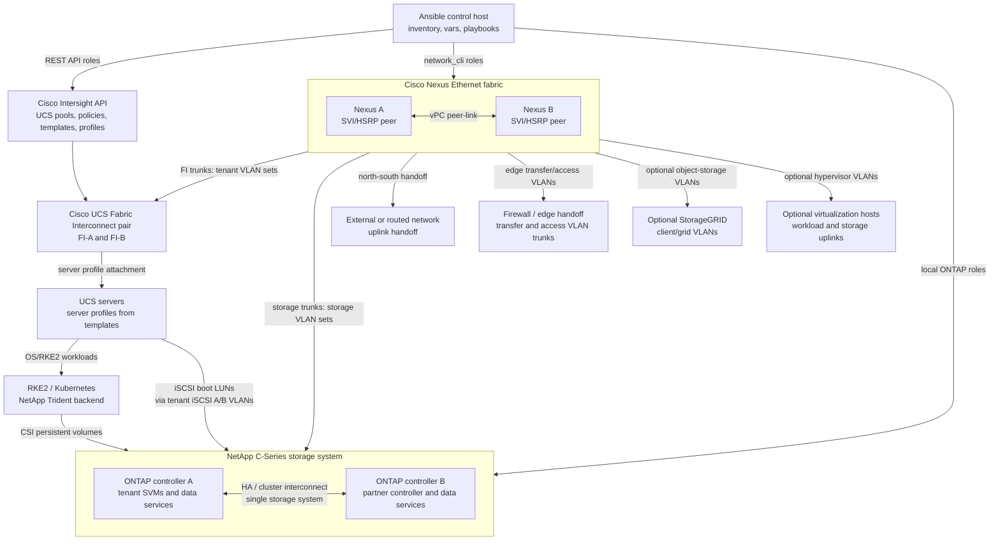
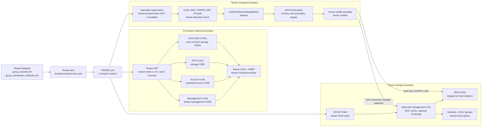

# Architecture Overview Diagram

[Documentation index](README.md) | [Architecture](architecture.md) | [Variables](variables.md) | [Playbooks](playbooks.md) | [Tenants](tenants/README.md)

This page gives a Technical Marketing style overview of the components managed by this Ansible framework. Because this is the public FlexPod-IMM-Rancher repository, device names, tenant names, VLAN IDs, and IP networks in this page are anonymized examples. Private deployment documentation can keep the full site-specific values.

## Current Public View

| Area | Public documentation view |
| --- | --- |
| Multi-tenancy mode | Secure multi-tenancy with one logical VRF boundary per tenant |
| Tenant examples | Public docs show neutral sample tenants while private deployment docs keep the real tenant catalog |
| Core Ethernet fabric | Redundant Cisco Nexus pair with vPC, peer-link, VLAN trunks, SVIs, and HSRP |
| Storage system | One NetApp C-Series storage system represented as two connected ONTAP controllers |
| Compute automation | Cisco Intersight API creates UCS pools, policies, templates, and server profiles |
| Enabled shared protocols | NFS and iSCSI are the primary public examples; FC, NVMe/TCP, and FC-NVMe are role-supported patterns |

## Physical Component View

## Logical Tenant Isolation View

## Playbook And Role Flow

```mermaid
flowchart TB
  infra["INFRA.yml<br/>shared FlexPod base"]
  tenant["TENANT.yml<br/>one tenant at a time"]
  rke["RKE2.yml<br/>platform configuration"]

  infra --> infnexus["INFRA/nexus_*<br/>features, VLANs, vPC, edge, object storage, hypervisor uplinks"]
  infra --> infontap["INFRA/ontap_*<br/>network, SVM, volumes, LIFs"]
  infra --> infucs["INFRA/ucs_create_pools<br/>shared Intersight pools"]

  tenant --> tnexus["TENANT/nexus_*<br/>tenant VLANs, VRF, SVIs, trunks"]
  tenant --> tontap["TENANT/ontap_*<br/>tenant SVM, LIFs, volumes, LUNs, NVMe"]
  tenant --> tucs["TENANT/ucs_*<br/>tenant pools, policies, templates, profiles"]
  tenant --> os["TENANT/os_install_suse<br/>OS installation workflow"]
  tenant --> trident["TENANT/trident_install<br/>Kubernetes storage backend"]

  rke --> pre["rancher/pre_rke_install"]
  rke --> server["rancher/rke2_server"]
  rke --> agent["rancher/rke2_agent"]
```

## Network Connections Managed By The Framework

| Connection | Public label | Purpose |
| --- | --- | --- |
| External network | Nexus peer uplink port-channel | Data center, campus, or firewall handoff |
| Cisco UCS Fabric Interconnect A | Nexus vPC member port-channel | Carries management, access, and storage VLANs to UCS fabric A, including iSCSI boot networks |
| Cisco UCS Fabric Interconnect B | Nexus vPC member port-channel | Carries management, access, and storage VLANs to UCS fabric B, including iSCSI boot networks |
| NetApp storage controller A | Nexus storage port-channel pair | Carries tenant storage VLANs and storage LIF traffic |
| NetApp storage controller B | Nexus storage port-channel pair | Carries tenant storage VLANs and storage LIF traffic |
| Firewall or routed edge | Tenant access and transfer VLAN trunks | Provides north-south routing or security policy outside the tenant VRF |
| Optional StorageGRID | StorageGRID client and grid VLAN trunks | Adds object-storage connectivity when the role set is used |
| Optional virtualization hosts | Hypervisor uplinks | Carries workload and storage networks to non-UCS hosts when configured |

## Storage And SAN Objects

The physical view treats both ONTAP controllers as connected controllers in the same NetApp storage system. Public docs do not expose site-specific controller hostnames, management IPs, or aggregate names.

| Object | Public label | Configuration to expect |
| --- | --- | --- |
| ONTAP controller A | Storage controller A | Node management, data aggregates, broadcast domains, VLAN ports, LIFs |
| ONTAP controller B | Storage controller B | Partner node management, data aggregates, broadcast domains, VLAN ports, LIFs |
| Tenant SVM | tenant##_svm | Root volume, management LIF, data LIFs, protocol services, export or block access |
| iSCSI boot LUNs | Tenant boot volume and host LUN mappings | UCS server profiles boot from ONTAP LUNs through tenant iSCSI A/B target LIFs |
| SAN fabric A | SAN-A | VSAN, device aliases, zones, and zoneset for fabric A |
| SAN fabric B | SAN-B | VSAN, device aliases, zones, and zoneset for fabric B |

## Public Tenant Examples

The table below is illustrative. Real tenant names, VLAN IDs, CIDRs, and SVM names are intentionally kept out of the public documentation.

| Tenant | Type | VRF | Example VLANs | Example CIDRs | Storage | Profiles |
| --- | --- | --- | --- | --- | --- | --- |
| tenant01 | physical | tenant01 | mgmt 301 access 302 NFS 303 iSCSI A/B 304/305 | mgmt 192.0.2.0/24 access 198.51.100.0/24 NFS 203.0.113.0/24 | tenant01_svm NFS plus iSCSI boot LUNs | 3 |
| tenant02 | virtual | tenant02 | access 312 NFS 313 | access 198.51.100.0/24 NFS 203.0.113.0/24 | tenant02_svm NFS | 3 |
| tenant-hub | carrier / registry | shared or upstream VRF | registry publishes vNN access/NFS VLANs | documentation networks only | shared SVM or delegated tenant SVMs | deployment-specific |

## Virtual Tenant Registry Example

Carrier or hub tenants can publish `vNN_*` registry entries for virtual tenants. The public view shows the pattern without exposing the internal registry names.

| Registry owner | Virtual tenant | Access network | NFS network |
| --- | --- | --- | --- |
| tenant-hub | v10 tenant01 | access VLAN 302 / 198.51.100.0/24 | NFS VLAN 303 / 203.0.113.0/24 |
| tenant-hub | v11 tenant02 | access VLAN 312 / 198.51.100.0/24 | NFS VLAN 313 / 203.0.113.0/24 |
| tenant-hub | v12 tenant03 | access VLAN 322 / 198.51.100.0/24 | NFS VLAN 323 / 203.0.113.0/24 |

## Managed Role Inventory

| Playbook | Roles called |
| --- | --- |
| `INFRA.yml` | INFRA/env_vars INFRA/nexus_config INFRA/nexus_config_sg INFRA/nexus_config_ip INFRA/nexus_config_proxmox INFRA/env_vars INFRA/ontap_network INFRA/ontap_svm INFRA/ontap_volumes INFRA/ontap_lifs INFRA/env_vars INFRA/ucs_create_pools INFRA/env_vars INFRA/nexus_config_asa |
| `TENANT.yml` | TENANT/env_vars TENANT/nexus_config TENANT/nexus_config_ip TENANT/nexus_config_sg TENANT/nexus_config_asa TENANT/env_vars TENANT/ontap_network TENANT/ontap_svm TENANT/ontap_volumes TENANT/ontap_lifs TENANT/ontap_luns TENANT/ontap_nvme TENANT/env_vars TENANT/ucs_create_pools TENANT/ucs_create_server_policies TENANT/ucs_create_sp_template TENANT/env_vars TENANT/ucs_create_server TENANT/env_vars TENANT/os_install_suse rancher/env_vars rancher/pre_rke_install rancher/env_vars rancher/rke2_server rancher/rke2_agent TENANT/env_vars TENANT/trident_install |
| `RKE2.yml` | rancher/env_vars rancher/pre_rke_install rancher/env_vars rancher/rke2_server rancher/rke2_agent |

## How To Explain This To An Audience

The easiest story is to present the framework in three layers:

1. The FlexPod base layer provides redundant Nexus switching, ONTAP storage, and Intersight-controlled UCS compute.
2. The tenant layer adds one isolated VRF, a small set of tenant VLANs and CIDRs, a tenant SVM, tenant iSCSI boot LUNs, and tenant-scoped Intersight objects.
3. UCS server profiles boot from ONTAP-backed iSCSI LUNs through the tenant iSCSI A/B networks.
4. The platform layer consumes that tenant boundary for RKE2, Harvester, Trident, or other workloads.

That framing makes the separation model visible: shared hardware and shared automation patterns below, tenant-local network, boot-storage, data-storage, and compute identities above.

## Related Design References

- [Cisco FlexPod Design Guides](https://www.cisco.com/c/en/us/solutions/design-zone/data-center-design-guides/flexpod-design-guides.html)
- [NetApp FlexPod Solutions](https://docs.netapp.com/us-en/flexpod/)
