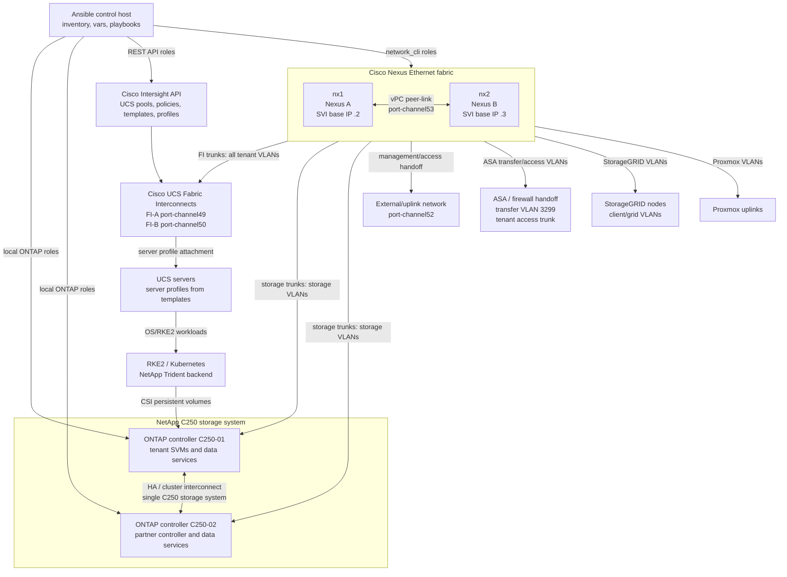
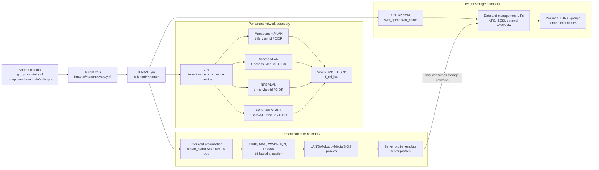

# Architecture Overview Diagram

[Documentation index](README.md) | [Architecture](architecture.md) | [Variables](variables.md) | [Playbooks](playbooks.md) | [Tenants](tenants/README.md)

This page gives a Technical Marketing style overview of the components managed by this Ansible framework. It is generated from the current repository variables and playbooks, so it is intended to explain what the automation is prepared to configure rather than to replace a cabling workbook or a low-level device configuration.

## Current Managed Estate

| Area | Current framework view |
| --- | --- |
| Multi-tenancy mode | `SMT: true` with default fallback VRF `admin` |
| Tenant directories | 37 total: 6 physical, 31 virtual |
| Virtual tenant registry entries | 50 entries across tenant vars with `v##_name` definitions |
| Core Ethernet fabric | Nexus pair `nx1` and `nx2`, vPC domain `101` |
| Storage system | One NetApp C250 storage system represented by C250-01 and C250-02 controller inventory entries |
| Compute automation | Cisco Intersight API creates UCS pools, policies, templates, and server profiles |
| Enabled shared protocols | iSCSI `true`, NFS `true`, FC `false`, NVMe/TCP `false`, FC-NVMe `false` |

## Physical Component View

## Logical Tenant Isolation View

## Playbook And Role Flow

```mermaid
flowchart TB
  infra["INFRA.yml<br/>shared FlexPod base"]
  tenant["TENANT.yml<br/>one tenant at a time"]
  rke["RKE2.yml<br/>platform configuration"]

  infra --> infnexus["INFRA/nexus_*<br/>features, VLANs, vPC, ASA, SG, Proxmox"]
  infra --> infontap["INFRA/ontap_*<br/>network, SVM, volumes, LIFs"]
  infra --> infucs["INFRA/ucs_create_pools<br/>shared Intersight pools"]

  tenant --> tnexus["TENANT/nexus_*<br/>tenant VLANs, VRF, SVIs, trunks"]
  tenant --> tontap["TENANT/ontap_*<br/>tenant SVM, LIFs, volumes, LUNs, NVMe"]
  tenant --> tucs["TENANT/ucs_*<br/>tenant pools, policies, templates, profiles"]
  tenant --> os["TENANT/os_install_suse<br/>OS installation workflow"]
  tenant --> trident["TENANT/trident_install<br/>Kubernetes storage backend"]

  rke --> pre["rancher/pre_rke_install"]
  rke --> server["rancher/rke2_server"]
  rke --> agent["rancher/rke2_agent"]
```

## Network Connections Managed By The Framework

| Connection | Port-channel | nx1 interfaces | nx2 interfaces | Purpose |
| --- | --- | --- | --- | --- |
| uplink | port-channel52: Fake-Uplink | Ethernet1/52 (Fake-Uplink) | Ethernet1/52 (Fake-Uplink) | External/uplink handoff |
| peerlink | port-channel53: vPC Peer Link | Ethernet1/53 (KL-IDTA-nx2:Eth1/53), Ethernet1/54 (KL-IDTA-nx2:Eth1/54) | Ethernet1/53 (KL-IDTA-nx1:Eth1/53), Ethernet1/54 (KL-IDTA-nx1:Eth1/54) | Nexus vPC peer-link |
| FI A | port-channel49: Uplink-FI-A | Ethernet1/49 (KL-IDTA-FI-A:Eth1/53) | Ethernet1/49 (KL-IDTA-FI-A:Eth1/54) | UCS Fabric Interconnect A |
| FI B | port-channel50: Uplink-FI-B | Ethernet1/50 (KL-IDTA-FI-B:Eth1/53) | Ethernet1/50 (KL-IDTA-FI-B:Eth1/54) | UCS Fabric Interconnect B |
| Storage A | port-channel25: C250-02n1-a0a | Ethernet1/25 (C250-02n1:e2a), Ethernet1/26 (C250-02n1:e2b) | Ethernet1/25 (C250-02n1:e2c), Ethernet1/26 (C250-02n1:e2d) | ONTAP storage node path |
| Storage B | port-channel27: C250-02n2-a0a | Ethernet1/27 (C250-02n2:e2a), Ethernet1/28 (C250-02n2:e2b) | Ethernet1/27 (C250-02n2:e2c), Ethernet1/28 (C250-02n2:e2d) | ONTAP storage node path |
| Storage C | port-channel29: C250-01n1-a0a | Ethernet1/29 (C250-01n1:e2a), Ethernet1/30 (C250-01n1:e2b) | Ethernet1/29 (C250-01n1:e2c), Ethernet1/30 (C250-01n1:e2d) | ONTAP storage node path |
| Storage D | port-channel31: C250-01n2-a0a | Ethernet1/31 (C250-01n2:e2a), Ethernet1/32 (C250-01n2:e2b) | Ethernet1/31 (C250-01n2:e2c), Ethernet1/32 (C250-01n2:e2d) | ONTAP storage node path |
| ASA/firewall | - | Ethernet1/17 (T-Admin-ASA-Eth1/6), Ethernet1/18 (T-Tenant-ASA-Eth1/7) | Ethernet1/17 (T-Admin-ASA-Eth1/6), Ethernet1/18 (T-Tenant-ASA-Eth1/7) | Transfer/access trunk handoff |
| StorageGRID 01 | - | Ethernet1/35 (sg5712-01-eth1) | Ethernet1/35 (sg5712-01-eth3) | StorageGRID data path |
| StorageGRID 02 | - | Ethernet1/36 (sg5712-02-eth1) | Ethernet1/36 (sg5712-02-eth3) | StorageGRID data path |
| StorageGRID 03 | - | Ethernet1/37 (sg5712-03-eth1) | Ethernet1/37 (sg5712-03-eth3) | StorageGRID data path |
| Proxmox 01 | - | Ethernet1/47 (Uplink Proxmox) | Ethernet1/47 (Uplink Proxmox) | Proxmox uplink |
| Proxmox 02 | - | Ethernet1/48 (Uplink Proxmox) | Ethernet1/48 (Uplink Proxmox) | Proxmox uplink |

## ONTAP Controller And SAN Objects

The physical view treats C250-01 and C250-02 as connected controllers in the same NetApp C250 storage system. The table below keeps the inventory entries visible because the playbooks target them through `host_vars/c250-*.yml`.

| Storage inventory entry | Node details from vars | Infrastructure SVM | Protocols and aggregates |
| --- | --- | --- | --- |
| C250-01 | c250-01n1 (172.16.4.21), c250-01n2 (172.16.4.23) | Infra-SVM | nfs, iscsi; aggregates: c250_01n1_aggr1, c250_01n2_aggr1 |
| C250-02 | c250-02n1 (172.16.4.26), c250-02n2 (172.16.4.28) | - | -; aggregates: c250_02n1_aggr1, c250_02n2_aggr1 |

| SAN device | VSAN name | VSAN ID | Zoning / port-channel intent |
| --- | --- | --- | --- |
| mdsA | FlexPod-Fabric-A | 101 | zoneset FlexPod-Fabric-A; port-channel 15 |
| mdsB | FlexPod-Fabric-B | 102 | zoneset FlexPod-Fabric-B; port-channel 15 |
| n9kSSA | FlexPod-Fabric-A | 101 | zoneset FlexPod-Fabric-A; port-channel 1103 |
| n9kSSB | FlexPod-Fabric-B | 102 | zoneset FlexPod-Fabric-B; port-channel 1103 |

## Tenant Catalog

Each row below comes from `tenants/<tenant>/vars.yml`. For secure multi-tenancy, the VRF normally follows the tenant name; a tenant can override that with `vrf_name` when it intentionally uses a shared or upstream VRF.

| Directory | Tenant / type | VRF | VLANs | CIDRs | ONTAP SVM | UCS profiles |
| --- | --- | --- | --- | --- | --- | --- |
| ahorn | ahorn virtual, tid 32 | ahorn | mgmt 445 access 445 NFS 446 iSCSI A/B 446/446 | mgmt 172.16.175.0/24 access 172.16.175.0/24 NFS 172.16.176.0 iSCSI A/B 172.16.176.0/24 / 172.16.176.0/24 | ahorn_svm nfs client 172.16.176.0/24 | 3 |
| belchen | belchen physical, tid 03 | belchen | mgmt 212 access 211 NFS 210 iSCSI A/B 208/209 | mgmt 172.17.12.0/24 access 172.17.11.0/24 NFS 172.17.10.0 iSCSI A/B 172.17.8.0/24 / 172.17.9.0/24 | belchen_svm nfs, iscsi client 172.17.10.0/24 | 3 |
| birke | birke virtual, tid 27 | birke | mgmt 420 access 420 NFS 421 iSCSI A/B 421/421 | mgmt 172.16.150.0/24 access 172.16.150.0/24 NFS 172.16.151.0 iSCSI A/B 172.16.151.0/24 / 172.16.151.0/24 | birke_svm nfs client 172.16.151.0/24 | 3 |
| dataspace | DataSpace physical, tid 01 | admin | mgmt 101 access 102 NFS 103 iSCSI A/B 104/105 NVMe A/B 198/199 | mgmt 172.16.4.0/22 access 172.16.8.0/23 NFS 172.16.10.0 iSCSI A/B 172.16.11.0/24 / 172.16.12.0/24 | Infra-SVM nfs, iscsi client 172.16.10.0/24 | 0 |
| douglasie | douglasie virtual, tid 11 | douglasie | mgmt 305 access 305 NFS 306 iSCSI A/B 306/306 | mgmt 172.16.35.0/24 access 172.16.35.0/24 NFS 172.16.36.0 iSCSI A/B 172.16.36.0/24 / 172.16.36.0/24 | douglasie_svm nfs client 172.16.36.0/24 | 3 |
| eberesche | eberesche virtual, tid 12 | eberesche | mgmt 310 access 310 NFS 311 iSCSI A/B 311/311 | mgmt 172.16.40.0/24 access 172.16.40.0/24 NFS 172.16.41.0 iSCSI A/B 172.16.41.0/24 / 172.16.41.0/24 | eberesche_svm nfs client 172.16.41.0/24 | 3 |
| edelkastanie | edelkastanie virtual, tid 20 | edelkastanie | mgmt 350 access 350 NFS 351 iSCSI A/B 351/351 | mgmt 172.16.80.0/24 access 172.16.80.0/24 NFS 172.16.81.0 iSCSI A/B 172.16.81.0/24 / 172.16.81.0/24 | edelkastanie_svm nfs client 172.16.81.0/24 | 3 |
| edeltanne | edeltanne virtual, tid 21 | edeltanne | mgmt 390 access 390 NFS 391 iSCSI A/B 391/391 | mgmt 172.16.120.0/24 access 172.16.120.0/24 NFS 172.16.121.0 iSCSI A/B 172.16.121.0/24 / 172.16.121.0/24 | edeltanne_svm nfs client 172.16.121.0/24 | 3 |
| eibe | eibe virtual, tid 18 | eibe | mgmt 335 access 335 NFS 336 iSCSI A/B 336/336 | mgmt 172.16.65.0/24 access 172.16.65.0/24 NFS 172.16.66.0 iSCSI A/B 172.16.66.0/24 / 172.16.66.0/24 | eibe_svm nfs client 172.16.66.0/24 | 3 |
| elsbeere | elsbeere virtual, tid 14 | elsbeere | mgmt 320 access 320 NFS 321 iSCSI A/B 321/321 | mgmt 172.16.50.0/24 access 172.16.50.0/24 NFS 172.16.51.0 iSCSI A/B 172.16.51.0/24 / 172.16.51.0/24 | elsbeere_svm nfs client 172.16.51.0/24 | 3 |
| feldahorn | feldahorn virtual, tid 20 | feldahorn | mgmt 380 access 380 NFS 381 iSCSI A/B 381/381 | mgmt 172.16.110.0/24 access 172.16.110.0/24 NFS 172.16.111.0 iSCSI A/B 172.16.111.0/24 / 172.16.111.0/24 | feldahorn_svm nfs client 172.16.111.0/24 | 3 |
| fichte | fichte virtual, tid 23 | fichte | mgmt 400 access 400 NFS 401 iSCSI A/B 401/401 | mgmt 172.16.130.0/24 access 172.16.130.0/24 NFS 172.16.131.0 iSCSI A/B 172.16.131.0/24 / 172.16.131.0/24 | fichte_svm nfs client 172.16.131.0/24 | 3 |
| gpusystem | gpu physical, tid 02 | gpu | mgmt 200 access 204 NFS 203 iSCSI A/B 201/202 NVMe A/B 205/206 | mgmt 172.17.0.0/24 access 172.17.4.0/24 NFS 172.17.3.0 iSCSI A/B 172.17.1.0/24 / 172.17.2.0/24 | gpu_svm nfs, iscsi client 172.17.3.0/24 | 0 |
| hainbuche | hainbuche virtual, tid 16 | hainbuche | mgmt 330 access 330 NFS 331 iSCSI A/B 331/331 | mgmt 172.16.60.0/24 access 172.16.60.0/24 NFS 172.16.61.0 iSCSI A/B 172.16.61.0/24 / 172.16.61.0/24 | hainbuche_svm nfs client 172.16.61.0/24 | 3 |
| harvester | DataSpace physical, tid 01 | DataSpace | mgmt 101 access 102 NFS 103 iSCSI A/B 104/105 NVMe A/B 198/199 | mgmt 172.16.4.0/22 access 172.16.8.0/23 NFS 172.16.10.0 iSCSI A/B 172.16.11.0/24 / 172.16.12.0/24 | Infra-SVM nfs, iscsi client 172.16.10.0/24 | 0 |
| haselnuss | haselnuss virtual, tid 24 | haselnuss | mgmt 405 access 405 NFS 406 iSCSI A/B 406/406 | mgmt 172.16.135.0/24 access 172.16.135.0/24 NFS 172.16.136.0 iSCSI A/B 172.16.136.0/24 / 172.16.136.0/24 | haselnuss_svm nfs client 172.16.136.0/24 | 3 |
| kastanie | kastanie virtual, tid 33 | kastanie | mgmt 450 access 450 NFS 451 iSCSI A/B 451/451 | mgmt 172.16.180.0/24 access 172.16.180.0/24 NFS 172.16.181.0 iSCSI A/B 172.16.181.0/24 / 172.16.181.0/24 | kastanie_svm nfs client 172.16.181.0/24 | 3 |
| laerche | laerche virtual, tid 30 | laerche | mgmt 435 access 435 NFS 436 iSCSI A/B 436/436 | mgmt 172.16.165.0/24 access 172.16.165.0/24 NFS 172.16.166.0 iSCSI A/B 172.16.166.0/24 / 172.16.166.0/24 | laerche_svm nfs client 172.16.166.0/24 | 3 |
| robinie | robinie virtual, tid 10 | robinie | mgmt 300 access 300 NFS 301 iSCSI A/B 301/301 | mgmt 172.16.30.0/24 access 172.16.30.0/24 NFS 172.16.31.0 iSCSI A/B 172.16.31.0/24 / 172.16.31.0/24 | robinie_svm nfs client 172.16.31.0/24 | 3 |
| rosskastanie | rosskastanie virtual, tid 21 | rosskastanie | mgmt 355 access 355 NFS 356 iSCSI A/B 356/356 | mgmt 172.16.85.0/24 access 172.16.85.0/24 NFS 172.16.86.0 iSCSI A/B 172.16.86.0/24 / 172.16.86.0/24 | rosskastanie_svm nfs client 172.16.86.0/24 | 3 |
| rotbuche | rotbuche virtual, tid 23 | rotbuche | mgmt 365 access 365 NFS 366 iSCSI A/B 366/366 | mgmt 172.16.95.0/24 access 172.16.95.0/24 NFS 172.16.96.0 iSCSI A/B 172.16.96.0/24 / 172.16.96.0/24 | rotbuche_svm nfs client 172.16.96.0/24 | 3 |
| schwarzdorn | schwarzdorn virtual, tid 31 | schwarzdorn | mgmt 440 access 440 NFS 441 iSCSI A/B 441/441 | mgmt 172.16.170.0/24 access 172.16.170.0/24 NFS 172.16.171.0 iSCSI A/B 172.16.171.0/24 / 172.16.171.0/24 | schwarzdorn_svm nfs client 172.16.171.0/24 | 3 |
| schwarzerle | schwarzerle virtual, tid 20 | schwarzerle | mgmt 385 access 385 NFS 386 iSCSI A/B 386/386 | mgmt 172.16.115.0/24 access 172.16.115.0/24 NFS 172.16.116.0 iSCSI A/B 172.16.116.0/24 / 172.16.116.0/24 | schwarzerle_svm nfs client 172.16.116.0/24 | 3 |
| seebuck | seebuck physical, tid 04 | seebuck | mgmt 216 access 220 NFS 217 iSCSI A/B 215/218 | mgmt 172.17.16.0/24 access 172.17.20.0/24 NFS 172.17.17.0 iSCSI A/B 172.16.23.0/24 / 172.17.18.0/24 | seebuck_svm nfs, iscsi client 172.17.17.0/24 | 3 |
| silberweide | silberweide virtual, tid 22 | silberweide | mgmt 395 access 395 NFS 396 iSCSI A/B 396/396 | mgmt 172.16.125.0/24 access 172.16.125.0/24 NFS 172.16.126.0 iSCSI A/B 172.16.126.0/24 / 172.16.126.0/24 | silberweide_svm nfs client 172.16.126.0/24 | 3 |
| sommerlinde | sommerlinde virtual, tid 24 | sommerlinde | mgmt 370 access 370 NFS 371 iSCSI A/B 371/371 | mgmt 172.16.100.0/24 access 172.16.100.0/24 NFS 172.16.101.0 iSCSI A/B 172.16.101.0/24 / 172.16.101.0/24 | sommerlinde_svm nfs client 172.16.101.0/24 | 3 |
| speierling | speierling virtual, tid 15 | speierling | mgmt 325 access 325 NFS 326 iSCSI A/B 326/326 | mgmt 172.16.55.0/24 access 172.16.55.0/24 NFS 172.16.56.0 iSCSI A/B 172.16.56.0/24 / 172.16.56.0/24 | speierling_svm nfs client 172.16.56.0/24 | 3 |
| stechpalme | stechpalme virtual, tid 25 | stechpalme | mgmt 410 access 410 NFS 411 iSCSI A/B 411/411 | mgmt 172.16.140.0/24 access 172.16.140.0/24 NFS 172.16.141.0 iSCSI A/B 172.16.141.0/24 / 172.16.141.0/24 | stechpalme_svm nfs client 172.16.141.0/24 | 3 |
| stieleiche | stieleiche virtual, tid 28 | stieleiche | mgmt 425 access 425 NFS 426 iSCSI A/B 426/426 | mgmt 172.16.155.0/24 access 172.16.155.0/24 NFS 172.16.156.0 iSCSI A/B 172.16.156.0/24 / 172.16.156.0/24 | stieleiche_svm nfs client 172.16.156.0/24 | 3 |
| test01 | test01 physical, tid 03 | test01 | mgmt 300 access 3304 NFS 3303 iSCSI A/B 301/302 NVMe A/B 305/306 | mgmt 172.18.0.0/24 access 172.18.4.0/24 NFS 172.18.3.0 iSCSI A/B 172.18.1.0/24 / 172.18.2.0/24 | test01_svm nfs, iscsi client 172.18.3.0/24 | 3 |
| vogelkirsche | vogelkirsche virtual, tid 25 | vogelkirsche | mgmt 375 access 375 NFS 376 iSCSI A/B 376/376 | mgmt 172.16.105.0/24 access 172.16.105.0/24 NFS 172.16.106.0 iSCSI A/B 172.16.106.0/24 / 172.16.106.0/24 | vogelkirsche_svm nfs client 172.16.106.0/24 | 3 |
| wacholder | wacholder virtual, tid 22 | wacholder | mgmt 360 access 360 NFS 361 iSCSI A/B 361/361 | mgmt 172.16.90.0/24 access 172.16.90.0/24 NFS 172.16.91.0 iSCSI A/B 172.16.91.0/24 / 172.16.91.0/24 | wacholder_svm nfs client 172.16.91.0/24 | 3 |
| waldkiefer | waldkiefer virtual, tid 19 | waldkiefer | mgmt 345 access 345 NFS 346 iSCSI A/B 346/346 | mgmt 172.16.75.0/24 access 172.16.75.0/24 NFS 172.16.76.0 iSCSI A/B 172.16.76.0/24 / 172.16.76.0/24 | waldkiefer_svm nfs client 172.16.76.0/24 | 3 |
| walnuss | walnuss virtual, tid 13 | walnuss | mgmt 315 access 315 NFS 316 iSCSI A/B 316/316 | mgmt 172.16.45.0/24 access 172.16.45.0/24 NFS 172.16.46.0 iSCSI A/B 172.16.46.0/24 / 172.16.46.0/24 | walnuss_svm nfs client 172.16.46.0/24 | 3 |
| weissdorn | weissdorn virtual, tid 26 | weissdorn | mgmt 415 access 415 NFS 416 iSCSI A/B 416/416 | mgmt 172.16.145.0/24 access 172.16.145.0/24 NFS 172.16.146.0 iSCSI A/B 172.16.146.0/24 / 172.16.146.0/24 | weissdorn_svm nfs client 172.16.146.0/24 | 3 |
| winterlinde | winterlinde virtual, tid 17 | winterlinde | mgmt 340 access 340 NFS 341 iSCSI A/B 341/341 | mgmt 172.16.70.0/24 access 172.16.70.0/24 NFS 172.16.71.0 iSCSI A/B 172.16.71.0/24 / 172.16.71.0/24 | winterlinde_svm nfs client 172.16.71.0/24 | 3 |
| zirbe | zirbe virtual, tid 29 | zirbe | mgmt 430 access 430 NFS 431 iSCSI A/B 431/431 | mgmt 172.16.160.0/24 access 172.16.160.0/24 NFS 172.16.161.0 iSCSI A/B 172.16.161.0/24 / 172.16.161.0/24 | zirbe_svm nfs client 172.16.161.0/24 | 3 |

## Virtual Tenant Registry

The registry below shows `v##_name` definitions found inside tenant vars. These are used by carrier tenants such as the DataSpace/Harvester definitions to publish virtual tenant access and NFS VLANs from a parent tenant context.

| Parent directory | Parent tenant | Virtual tenant | Access VLAN / CIDR | NFS VLAN / CIDR |
| --- | --- | --- | --- | --- |
| dataspace | DataSpace | v10 robinie | 300 / 172.16.30.0/24 | 301 / 172.16.31.0/24 |
| dataspace | DataSpace | v11 douglasie | 305 / 172.16.35.0/24 | 306 / 172.16.36.0/24 |
| dataspace | DataSpace | v12 eberesche | 310 / 172.16.40.0/24 | 311 / 172.16.41.0/24 |
| dataspace | DataSpace | v13 walnuss | 315 / 172.16.45.0/24 | 316 / 172.16.46.0/24 |
| dataspace | DataSpace | v14 elsbeere | 320 / 172.16.50.0/24 | 321 / 172.16.51.0/24 |
| dataspace | DataSpace | v15 speierling | 325 / 172.16.55.0/24 | 326 / 172.16.56.0/24 |
| dataspace | DataSpace | v16 hainbuche | 330 / 172.16.60.0/24 | 331 / 172.16.61.0/24 |
| dataspace | DataSpace | v17 eibe | 335 / 172.16.65.0/24 | 336 / 172.16.66.0/24 |
| dataspace | DataSpace | v18 winterlinde | 340 / 172.16.70.0/24 | 341 / 172.16.71.0/24 |
| dataspace | DataSpace | v19 waldkiefer | 345 / 172.16.75.0/24 | 346 / 172.16.76.0/24 |
| dataspace | DataSpace | v20 edelkastanie | 350 / 172.16.80.0/24 | 351 / 172.16.81.0/24 |
| dataspace | DataSpace | v21 rosskastanie | 355 / 172.16.85.0/24 | 356 / 172.16.86.0/24 |
| dataspace | DataSpace | v22 wacholder | 360 / 172.16.90.0/24 | 361 / 172.16.91.0/24 |
| dataspace | DataSpace | v23 rotbuche | 365 / 172.16.95.0/24 | 366 / 172.16.96.0/24 |
| dataspace | DataSpace | v24 sommerlinde | 370 / 172.16.100.0/24 | 371 / 172.16.101.0/24 |
| dataspace | DataSpace | v25 vogelkirsche | 375 / 172.16.105.0/24 | 376 / 172.16.106.0/24 |
| dataspace | DataSpace | v26 feldahorn | 380 / 172.16.110.0/24 | 381 / 172.16.111.0/24 |
| dataspace | DataSpace | v27 schwarzerle | 385 / 172.16.115.0/24 | 386 / 172.16.116.0/24 |
| dataspace | DataSpace | v28 edeltanne | 390 / 172.16.120.0/24 | 391 / 172.16.121.0/24 |
| dataspace | DataSpace | v29 silberweide | 395 / 172.16.125.0/24 | 396 / 172.16.126.0/24 |
| dataspace | DataSpace | v30 fichte | 400 / 172.16.130.0/24 | 401 / 172.16.131.0/24 |
| dataspace | DataSpace | v31 haselnuss | 405 / 172.16.135.0/24 | 406 / 172.16.136.0/24 |
| dataspace | DataSpace | v32 stechpalme | 410 / 172.16.140.0/24 | 411 / 172.16.141.0/24 |
| dataspace | DataSpace | v33 weissdorn | 415 / 172.16.145.0/24 | 416 / 172.16.146.0/24 |
| dataspace | DataSpace | v34 birke | 420 / 172.16.150.0/24 | 421 / 172.16.151.0/24 |
| dataspace | DataSpace | v35 stieleiche | 425 / 172.16.155.0/24 | 426 / 172.16.156.0/24 |
| dataspace | DataSpace | v36 zirbe | 430 / 172.16.160.0/24 | 431 / 172.16.161.0/24 |
| dataspace | DataSpace | v37 laerche | 435 / 172.16.165.0/24 | 436 / 172.16.166.0/24 |
| dataspace | DataSpace | v38 schwarzdorn | 440 / 172.16.170.0/24 | 441 / 172.16.171.0/24 |
| dataspace | DataSpace | v39 ahorn | 445 / 172.16.175.0/24 | 446 / 172.16.176.0/24 |
| dataspace | DataSpace | v40 kastanie | 450 / 172.16.180.0/24 | 451 / 172.16.181.0/24 |
| dataspace | DataSpace | v98 gpu | 204 / 172.17.4.0/24 | 203 / 172.17.3.0/24 |
| dataspace | DataSpace | v99 tanne | 3998 / 172.16.254.0/24 | 3999 / 172.16.255.0/24 |
| harvester | DataSpace | v10 robinie | 300 / 172.16.30.0/24 | 301 / 172.16.31.0/24 |
| harvester | DataSpace | v11 douglasie | 305 / 172.16.35.0/24 | 306 / 172.16.36.0/24 |
| harvester | DataSpace | v12 eberesche | 310 / 172.16.40.0/24 | 311 / 172.16.41.0/24 |
| harvester | DataSpace | v13 walnuss | 315 / 172.16.45.0/24 | 316 / 172.16.46.0/24 |
| harvester | DataSpace | v14 elsbeere | 320 / 172.16.50.0/24 | 321 / 172.16.51.0/24 |
| harvester | DataSpace | v15 speierling | 325 / 172.16.55.0/24 | 326 / 172.16.56.0/24 |
| harvester | DataSpace | v16 hainbuche | 330 / 172.16.60.0/24 | 331 / 172.16.61.0/24 |
| harvester | DataSpace | v17 eibe | 335 / 172.16.65.0/24 | 336 / 172.16.66.0/24 |
| harvester | DataSpace | v18 winterlinde | 340 / 172.16.70.0/24 | 341 / 172.16.71.0/24 |
| harvester | DataSpace | v19 waldkiefer | 345 / 172.16.75.0/24 | 346 / 172.16.76.0/24 |
| harvester | DataSpace | v20 edelkastanie | 350 / 172.16.80.0/24 | 351 / 172.16.81.0/24 |
| harvester | DataSpace | v21 rosskastanie | 355 / 172.16.85.0/24 | 356 / 172.16.86.0/24 |
| harvester | DataSpace | v22 wacholder | 360 / 172.16.90.0/24 | 361 / 172.16.91.0/24 |
| harvester | DataSpace | v23 rotbuche | 365 / 172.16.95.0/24 | 366 / 172.16.96.0/24 |
| harvester | DataSpace | v24 sommerlinde | 370 / 172.16.100.0/24 | 371 / 172.16.101.0/24 |
| harvester | DataSpace | v25 vogelkirsche | 375 / 172.16.105.0/24 | 376 / 172.16.106.0/24 |
| harvester | DataSpace | v99 tanne | 3998 / 172.16.254.0/24 | 3999 / 172.16.255.0/24 |

## Managed Role Inventory

| Playbook | Roles called |
| --- | --- |
| `INFRA.yml` | INFRA/env_vars INFRA/nexus_config INFRA/nexus_config_sg INFRA/nexus_config_ip INFRA/nexus_config_proxmox INFRA/env_vars INFRA/ontap_network INFRA/ontap_svm INFRA/ontap_volumes INFRA/ontap_lifs INFRA/env_vars INFRA/ucs_create_pools INFRA/env_vars INFRA/nexus_config_asa |
| `TENANT.yml` | TENANT/env_vars TENANT/nexus_config TENANT/nexus_config_ip TENANT/nexus_config_sg TENANT/nexus_config_asa TENANT/env_vars TENANT/ontap_network TENANT/ontap_svm TENANT/ontap_volumes TENANT/ontap_lifs TENANT/ontap_luns TENANT/ontap_nvme TENANT/env_vars TENANT/ucs_create_pools TENANT/ucs_create_server_policies TENANT/ucs_create_sp_template TENANT/env_vars TENANT/ucs_create_server TENANT/env_vars TENANT/os_install_suse rancher/env_vars rancher/pre_rke_install rancher/env_vars rancher/rke2_server rancher/rke2_agent TENANT/env_vars TENANT/trident_install |
| `RKE2.yml` | rancher/env_vars rancher/pre_rke_install rancher/env_vars rancher/rke2_server rancher/rke2_agent |

## How To Explain This To An Audience

The easiest story is to present the framework in three layers:

1. The FlexPod base layer provides redundant Nexus switching, ONTAP storage, and Intersight-controlled UCS compute.
2. The tenant layer adds one isolated VRF, a small set of tenant VLANs and CIDRs, a tenant SVM, and tenant-scoped Intersight objects.
3. The platform layer consumes that tenant boundary for RKE2, Harvester, Trident, or other workloads.

That framing makes the separation model visible: shared hardware and shared automation patterns below, tenant-local network/storage/compute identities above.

## Related Design References

- [Cisco FlexPod Design Guides](https://www.cisco.com/c/en/us/solutions/design-zone/data-center-design-guides/flexpod-design-guides.html)
- [NetApp FlexPod Solutions](https://docs.netapp.com/us-en/flexpod/)
