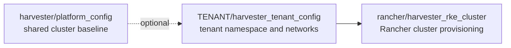

# Harvester Roles

[Role index](README.md) | [Workflows](../workflows.md) | [Playbooks](../playbooks.md) | [Product references](../references.md)

Harvester roles manage the HCI layer that hosts virtual tenants and the
Rancher-created RKE2 clusters running on top of those tenants.

| Role | Called by | Expected configuration |
| --- | --- | --- |
| [`harvester/platform_config`](../../roles/harvester/platform_config/README.md) | `HARVESTER.yml` with `harvester_manage_platform=true` | Harvester proxy, NTP, add-ons, `data-9000` ClusterNetwork, storage VlanConfig, and storage-network setting. |

## Operational Notes

Run platform changes deliberately because they affect the whole Harvester
cluster. Tenant support objects are handled by
[`TENANT/harvester_tenant_config`](../../roles/TENANT/harvester_tenant_config/README.md)
and can be created or removed per tenant.

