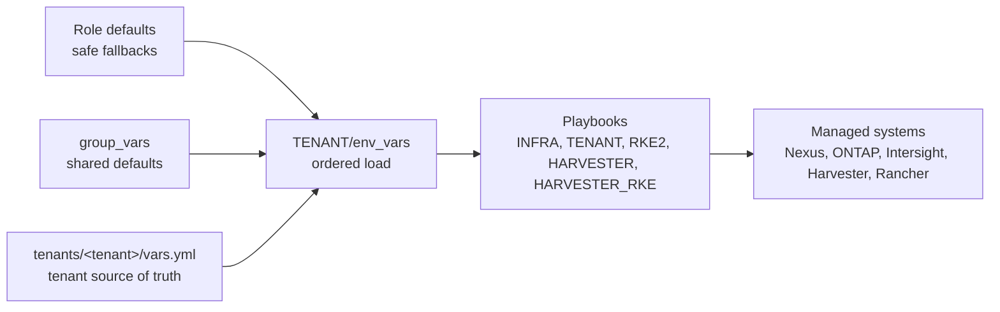

# Variables and Ownership

[Documentation index](README.md) | [Architecture](architecture.md) | [Workflows](workflows.md) | [Tenant guide](tenants/README.md)

The framework separates shared defaults from tenant-local facts. This keeps the common policy naming and boot/storage defaults maintainable while preserving the rule that every tenant can be configured and unconfigured independently.

## File Ownership

| File or directory | Purpose | Configuration to expect |
| --- | --- | --- |
| `group_vars/all.yml` | Global fabric and service defaults. | DNS, NTP, base VLANs, shared feature flags, shared service values. |
| `group_vars/ucs.yml` | Global Cisco Intersight and UCS defaults. | Intersight endpoint, infrastructure org, OOB pool ranges, global UCS policy settings. |
| `group_vars/storagegrid.yml` | Shared StorageGRID integration. | StorageGRID VLANs, port-channel values, grid/client network values. |
| `group_vars/proxmox.yml` | Shared Proxmox integration. | Proxmox Nexus/uplink values. |
| `group_vars/tenant_defaults.yml` | Reusable tenant defaults. | Generated policy names, descriptions, boot defaults, common list defaults. |
| `host_vars/*.yml` | Per-device topology. | Nexus/MDS/ONTAP host-specific interface, peer, and platform settings. |
| `tenants/<tenant>/vars.yml` | Tenant source of truth. | Tenant ID, VLAN IDs, CIDRs, API references, storage identities, profile counts. |
| `tenants/tenant-hub/vars.yml` | Default virtual tenant registry owner. | `vNN_*` values consumed by virtual tenant logic. |
| `tenants/<tenant>/manifests/*` | Generated runtime manifests. | Harvester, Rancher, workload, or add-on manifests rendered on live runs. Review before committing because cloud-init and application data can be deployment-specific. |

## What Must Stay Tenant-Local

- `tenant_name`, `tenant_type`, `tid`, and `lan_state`
- VLAN IDs, CIDRs, masks, and VRF names that identify a tenant
- API key references and private key paths
- Storage identities such as SVM, IQN, WWPN, LIF, export, LUN, volume, and pool starts
- Tenant-specific RKE2, Trident, Harvester, app, or manifest values
- Harvester namespace, access/storage VLANs, DHCP ranges, and cloud-init overrides
- Rancher-provisioned cluster sizing or image overrides when they are unique to one tenant

## What Belongs In Shared Defaults

- Generated names for policies, pools, vNICs, vHBAs, boot policies, and network groups
- Reusable descriptions
- Default masks/netmasks used by most tenants
- Common lists that are identical for all tenants
- Default Harvester and Rancher context names when the whole deployment uses the same kubeconfig naming
- Shared Harvester platform defaults such as add-on names, standard ClusterNetwork names, and common storage-network conventions

## Harvester And Rancher Variables

| Variable family | Default location | Private override location | Purpose |
| --- | --- | --- | --- |
| `harvester_context` | Role defaults | `group_vars` or private overlay | Kubeconfig context used for Harvester API operations. Public default is `harvester`. |
| `rancher_context` | Role defaults | `group_vars` or private overlay | Kubeconfig context used for Rancher provisioning API operations. Public default is `rancher`. |
| `harvester_platform_*` | `roles/harvester/platform_config/defaults/main.yml` | `group_vars` or private overlay | Platform-wide Harvester proxy, NTP, add-on, ClusterNetwork, VlanConfig, and storage-network settings. |
| `harvester_tenant_*` | `roles/TENANT/harvester_tenant_config/defaults/main.yaml` plus tenant vars | `tenants/<tenant>/vars.yml` | Tenant namespace, Harvester networks, DHCP pools, and cloud-init template adoption. |
| `harvester_rke_*` | `roles/rancher/harvester_rke_cluster/defaults/main.yml` | private overlay or selected tenant vars | Rancher HarvesterConfig, VM image, VM sizing, cloud credential refs, cluster name, node count, and proxy values. |
| `harvester_workload_*` | `roles/rancher/harvester_workload_config/defaults/main.yml` | selected tenant vars or private overlay | Optional downstream RKE2 add-ons such as kube-vip, storage annotations, Trident PSA RBAC, and Kasten. |

The public repository intentionally keeps Rancher cloud credential names, cloud-provider config secrets, creator IDs, StorageGRID access values, and real proxy endpoints as placeholders. Do not replace them in committed public files.

## Source Of Truth Flow

## Operator Guidance

When a value is repeated in many tenant files, ask two questions before moving it:

1. Is it truly identical for every tenant?
2. Is it not a credential, identity, VLAN, CIDR, or storage endpoint?

Only move it to shared defaults when both answers are yes.
