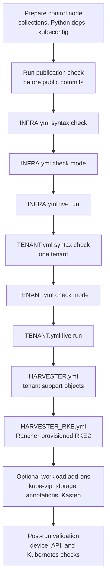
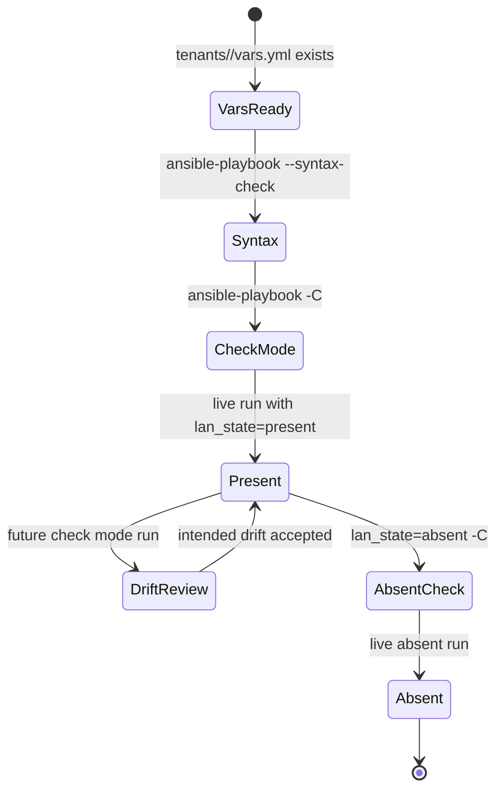
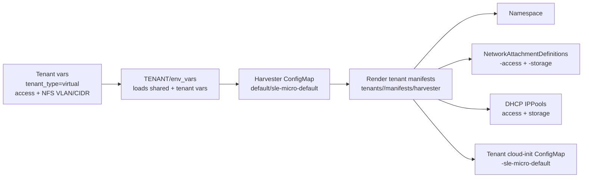
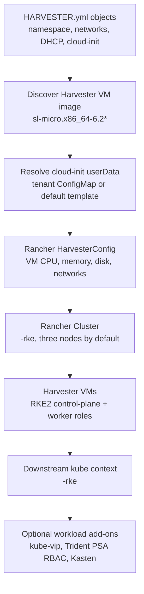
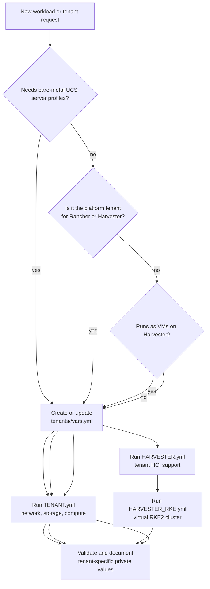
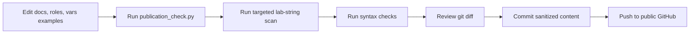

# Workflows

[Documentation index](README.md) | [Architecture](architecture.md) | [Playbooks](playbooks.md) | [Operations](operations.md) | [Validation](validation.md)

This page shows how the public FlexPod-IMM-Rancher automation is expected to be used. It is written for operators who know infrastructure basics but do not need to understand every role before running the first safe validation.

All tenant names, domains, VLAN IDs, and addresses shown here are examples. Put real values only in a private inventory, Ansible Vault, ignored overlay, or deployment-specific branch.

## End-To-End Deployment Flow

Use the first half of this workflow for physical tenants. Use the full workflow when a tenant also needs Harvester HCI support and a virtual RKE2 cluster.

## Tenant Lifecycle

Every tenant should be configurable and removable without editing another tenant directory. Shared defaults belong in `group_vars`, while tenant identity, VLANs, CIDRs, and storage identity stay in `tenants/<tenant>/vars.yml`.

## Harvester Tenant Workflow

`HARVESTER.yml` creates the tenant namespace, Harvester networks, DHCP pools, and tenant-adapted cloud-init template. Platform-wide Harvester settings such as proxy, NTP, add-ons, ClusterNetwork, VlanConfig, and storage-network are opt-in through `harvester_manage_platform=true`.

## Rancher RKE2-On-Harvester Workflow

`HARVESTER_RKE.yml` assumes Rancher already has a Harvester cloud credential and cloud-provider configuration. The public repository contains placeholder values such as `REPLACE_ME_RANCHER_CREATOR_ID`; real Rancher references must come from a private variable source.

## Physical And Virtual Tenant Decision Flow

Physical tenants use direct Nexus, ONTAP, Intersight, iSCSI boot, and optional RKE2/Trident flows. Virtual tenants use tenant YAML as the source of truth for Harvester networks and Rancher-provisioned RKE2 clusters.

## Public Repository Safety Flow

The publication flow is part of the documentation, not an optional extra. Public examples should keep topology shape, variable names, and operator guidance while removing live credentials, private hostnames, private domains, and customer-only addressing.
